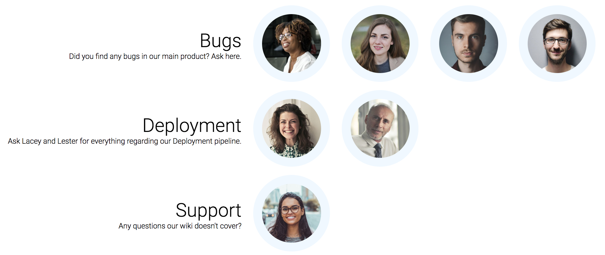

# team-roles-responsibilities

List the roles and responsibilities of your team members.

Always surprised by managers that hit your your office and have no clue which role and responsibility you've taken in your team? Print an overview of all the people in your team and their responsibilities and stick it to your door!



(Stock images by pexels.com)

## Configure
The `config.toml` is used to define people in your team and their responsibilities:

```
# Page title
title = "Responsibilities in our team"

# Page description
description = "See the topics our department handles and pick the first person thats available to find a solution for your problem."

# People
[[people]]
id = "p1"
name = "Lester"

[[people]]
id = "p2"
name = "Charlotte"

# Responsibilities
[[responsibilities]]
name = "Bugs"
descr = "Did you find any bugs in our main product? Ask here."
people = ["p2", "p1"]

[[responsibilities]]
name = "Deployment"
descr = "Ask Lacey and Lester for everything regarding our Deployment pipeline."
people = ["p2"]
```

## Install, build, run
- `npm install`
- `npm run build` / `npm run watch`
- `node server.js`